# Nestify

*Bar, tube, and profile cutting optimizer for metal fabrication shops.*

**[English](#english)** · **[Español](#español)**

<p align="center">
  <a href="docs/media/nestify_demo.mp4">
    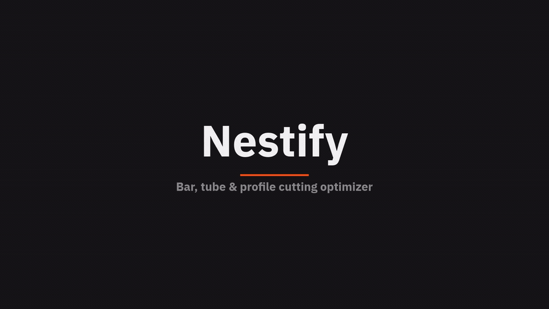
  </a>
</p>

<p align="center"><sub>▶ Live walkthrough — click for full-quality video</sub></p>

> **Status:** `1.0.0-pre-alpha.1` — first public pre-release. The core works, but
> interfaces and file formats may still change before `1.0.0`.

---

## English

Nestify helps you turn a list of required cuts into an efficient cutting plan.
You enter the stock bar length and the pieces you need (with quantities, miters,
and kerf), and it works out how many bars to buy, how to lay the pieces out, and
what the job weighs and costs. Everything runs locally — no account, no cloud,
no network.

It's built for estimators, detailers, and workshop staff who cut steel and
aluminium profiles and want to waste less material.

If you're new, the **[User Guide](.devcontainer/docs/USER_GUIDE.md)** walks
through every tab in detail.

### What it does

- **Optimizes** the cut layout with three bin-packing strategies (FFD, BFD, NFD),
  accounting for blade kerf and end margin.
- **Visualizes** the result on an interactive nesting canvas, with miter/bevel
  geometry, manual adjustments, and one-click auto-nest.
- **Estimates** weight, cost per piece, labour, and total job cost from your
  profile geometry and price tables.
- **Exports** cutting lists, quotes, and layouts to PDF, Excel, Word, and DXF.

All your data — jobs, custom profiles, materials, and stock — lives in a single
local SQLite database (`nestify_geometry.db`). You can point it at a shared or
network location from **File → Database management**, and it's snapshotted
automatically on launch. `.nestjob` files are an optional export format for
sharing a single job.

### Screenshots

| Cuts | Nesting |
|---|---|
| 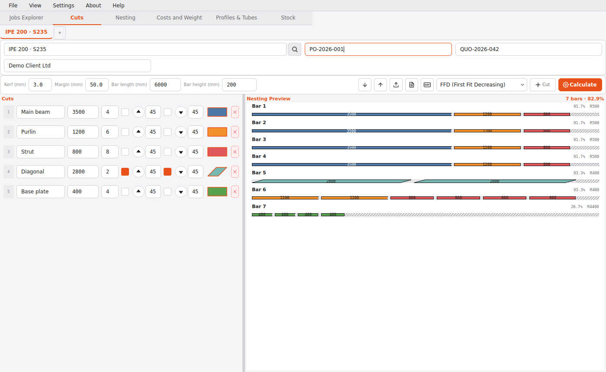 | 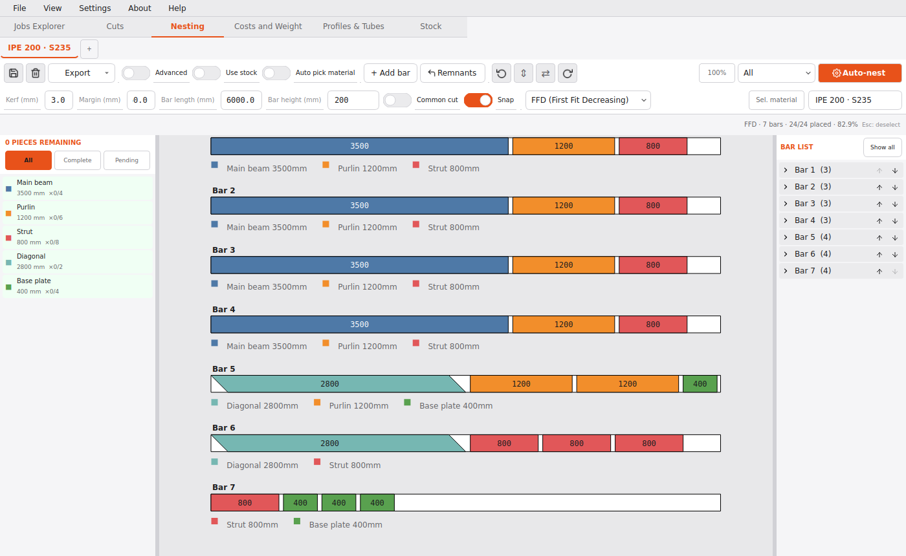 |
| **Costs & Weight** | **Profiles & Tubes** |
| 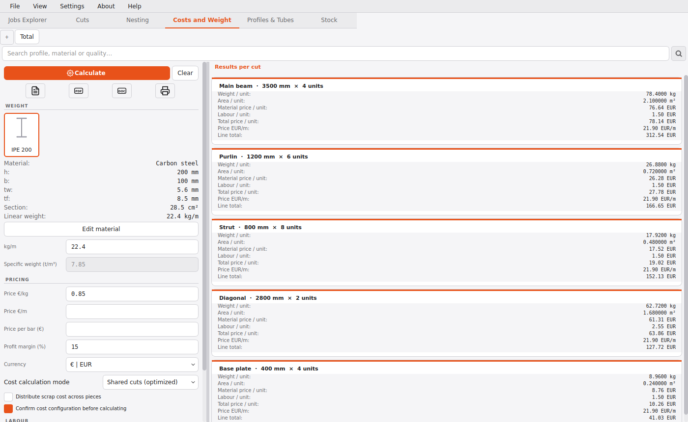 | 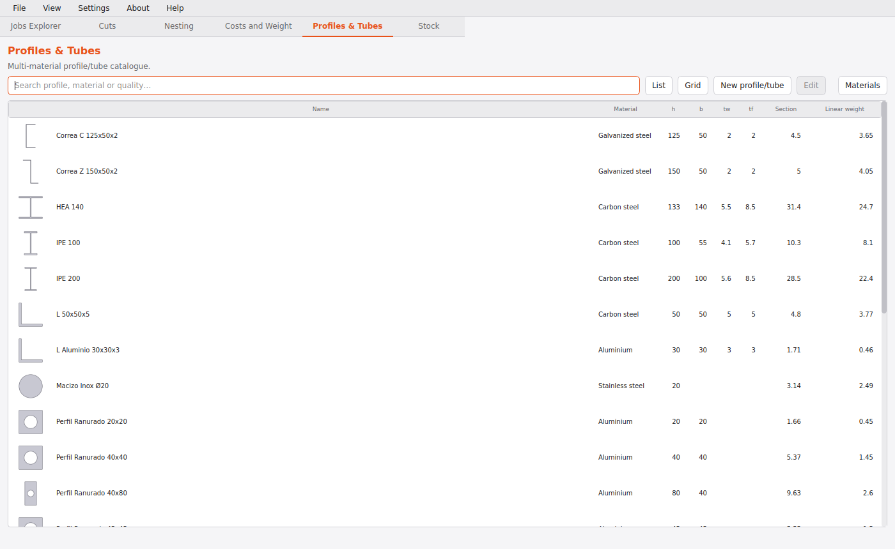 |
| **Stock** | **Jobs Explorer** |
| 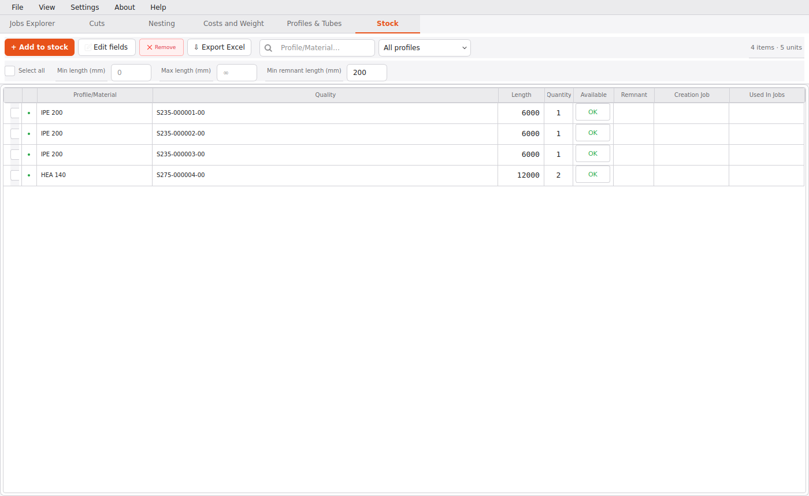 | 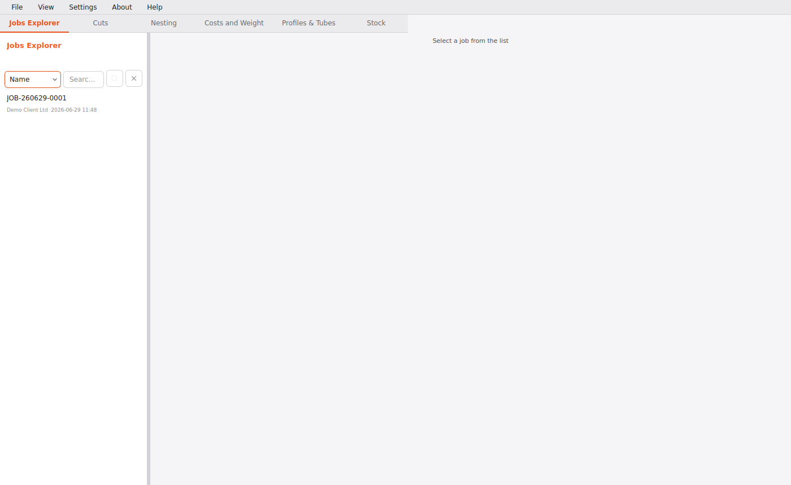 |

Light and dark themes are available — switch from **View → Theme**. The
screenshots above use the light theme.

<details>
<summary>Dark theme</summary>

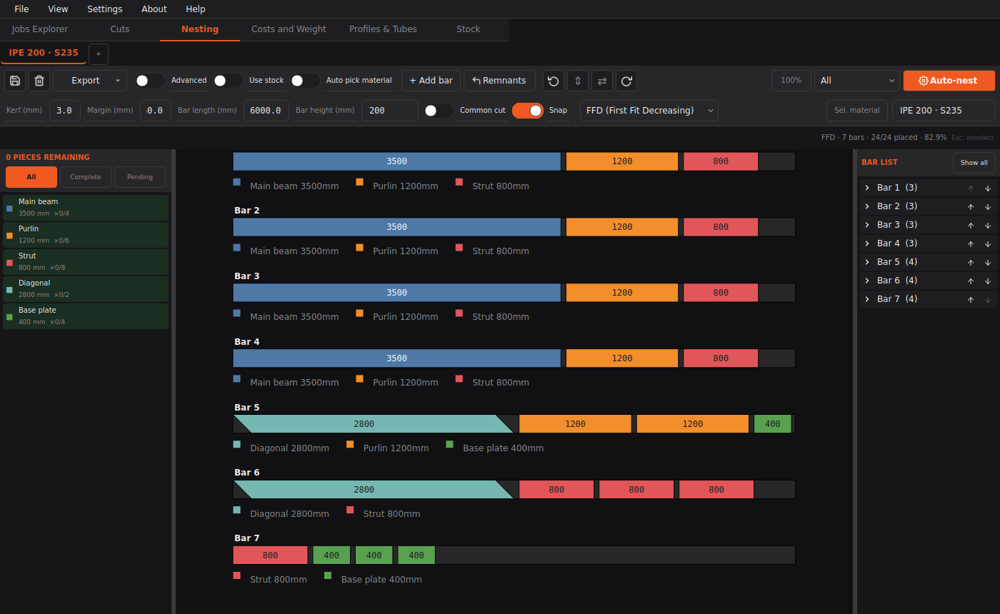

</details>

### Installing

**Windows (installer)** — download the latest `Nestify-*-setup.exe` from
[Releases](https://github.com/Grohle/nestify/releases) and run it. No Python
required; PySide6, fonts, and icons are bundled. SmartScreen may warn that the
binary is unsigned — choose **More info → Run anyway**.

**Windows (portable)** — download `Nestify-*-windows.zip`, extract, and run
`Nestify.exe`.

**From source** (Windows, macOS, Linux):

```bash
git clone https://github.com/Grohle/nestify.git
cd nestify
python3 -m venv venv && source venv/bin/activate   # Windows: venv\Scripts\activate
pip install -r requirements.txt
python3 main.py
```

Requires **Python 3.10+** and the packages in `requirements.txt` (PySide6,
fpdf2, openpyxl, pandas, python-docx, ezdxf, shapely, numpy, pyclipper, Pillow).

On a headless Linux box, run under a virtual display:

```bash
Xvfb :99 -screen 0 1280x1024x24 &
DISPLAY=:99 python3 main.py
```

### The six tabs

| Tab | What you do there |
|-----|-------------------|
| **Jobs Explorer** | Browse, search, open, and create saved jobs. |
| **Cuts** | Enter bar parameters and the cut list; pick the packing algorithm; calculate. |
| **Nesting** | Review and tweak the layout on an interactive canvas; auto-nest; export PDF/DXF/PNG. |
| **Costs & Weight** | Set profile geometry and pricing; get weight and cost per piece and per job. |
| **Profiles & Tubes** | Catalogue of built-in and custom sections (IPE, HEA, UPN, angles, tubes…). |
| **Stock** | Local bar inventory; plan against real stock and reuse offcuts. |

Cuts, Nesting, and Costs each support multiple **material sub-tabs**, so one job
file can hold several profiles or materials. The Costs tab adds a **Total**
sub-tab that sums them all.

The three packing algorithms:

| Code | Algorithm | Behaviour |
|------|-----------|-----------|
| **FFD** | First-Fit Decreasing | Sort pieces largest-first; place each in the first bar that fits. |
| **BFD** | Best-Fit Decreasing | Place each piece in the bar that leaves the least leftover. |
| **NFD** | Next-Fit Decreasing | Fill the current bar; open a new one when a piece doesn't fit. |

### Features

- Three packing algorithms with kerf and margin support
- Miter/bevel cuts with real 2D contour geometry (advanced nesting mode)
- Common-cut option to share a single blade pass between adjacent pieces
- Plan against real stock inventory and promote offcuts back to reusable stock
- Built-in profile library plus user-defined custom sections
- Materials and stock databases with density, pricing, serials, and job traceability
- Import cut lists from Excel; export cut lists, quotes, and inventory to Excel
- PDF export (cutting list, nesting diagram, quote) with bundled Unicode fonts
- DOCX quote export and per-piece DXF contour export
- All data in one local SQLite database — relocatable to a shared drive, with rolling automatic backups on every launch
- Metric and imperial units; dark and light themes
- English and Spanish interface
- Fully offline — no telemetry, no accounts

### Menus

| Menu | Contents |
|------|----------|
| **File** | Open, Save (`Ctrl+S`), Save As, save/load app config, Backups, Database management, Exit |
| **View** | Theme (dark/light), Language (English/Spanish), units (metric/imperial), per-cut colours |
| **Settings** | Materials, profile types, PDF config, cost defaults, optimisation time, nesting layout, name assignment |
| **About / Help** | Version and update check; link to report an issue |

### Data files

Everything stays on your machine, next to `Nestify.exe` (or in the project root
when running from source). The database can be moved to a shared drive from
**File → Database management**.

| Path | Purpose |
|------|---------|
| `nestify_geometry.db` | The database: jobs, custom profiles, materials, stock inventory, and preferences |
| `nestify_db_location.json` | Bootstrap pointer to the database location and backup policy |
| `backups/` | Rolling automatic database snapshots |
| `*.nestjob` | Optional export of a single job (cuts, profile, nesting state, costs) |
| `Profiles/` | Thumbnail cache for profile illustrations (rebuilt from the database) |
| `dxf/` | Auto-generated DXF contour files per piece |

Earlier versions kept preferences, materials, stock, and profiles in separate
JSON files; those are imported into the database automatically on first launch
and retired to `*.migrated`. Packing results are recomputed at runtime, so
reopen a job and press **Calculate** to refresh them.

### Building it yourself

On Windows (PowerShell, from the repo root):

```powershell
.\packaging\build_installer.ps1     # PyInstaller + Inno Setup → Nestify-<version>-setup.exe
```

Or build the bundle manually:

```powershell
pip install -r requirements.txt -r requirements-build.txt
pyinstaller --noconfirm packaging\nestify.spec
```

Pushing a `v*` tag triggers the Windows and Linux release builds in
`.github/workflows/`.

### Project layout

```
nestify/
├── main.py                  # Entry point
├── requirements.txt
├── packaging/               # PyInstaller spec, Inno Setup script, build scripts
├── docs/img/                # Screenshots used in this README
├── tests/                   # Test suite (pytest)
├── .devcontainer/           # Dev tooling and guides (not shipped)
└── nestify/
    ├── logic.py             # Bin packing, area, weight, cost
    ├── nesting_engine.py    # 2D contour nesting
    ├── bevel_geom.py        # Miter/bevel geometry and DXF collision
    ├── models.py            # Core data classes
    ├── i18n.py              # Translatable strings
    ├── stock_db.py          # Stock persistence
    └── ui_qt/               # PySide6 UI (one module per tab, dialogs, theme)
```

`logic.py`, `nesting_engine.py`, and `bevel_geom.py` are the calculation core and
are covered by tests. Run the suite before sending a change:

```bash
python3 -m pytest tests/ -q
flake8 --max-line-length=120 nestify/ main.py
```

A control-by-control reference lives in the
**[UI Map](.devcontainer/docs/UI_MAP.md)**.

### Optional FastReport integration

Nestify has a built-in WYSIWYG editor for PDF layouts (**Settings → PDF Config →
Edit layout**). For advanced templates you can also open a `.frx` file in
[FastReport Community Edition](https://github.com/FastReports/FastReport) — the
free, open-source report designer — via **Settings → PDF Config → Base PDF
template**. It's a separate tool and isn't required to use Nestify.

### Privacy

Nestify makes no network connections during normal use. Menu links (GitHub,
update check) open in your browser only when you click them. All project data
stays local.

### Credits

Developed by **Alberto Miranda**. Bug reports and contributions are welcome at
[github.com/Grohle/nestify/issues](https://github.com/Grohle/nestify/issues).

---

## Español

Nestify convierte una lista de cortes en un plan de corte eficiente. Introduces
la longitud de la barra y las piezas que necesitas (cantidades, ingletes, kerf)
y calcula cuántas barras comprar, cómo distribuir las piezas y cuánto pesa y
cuesta el trabajo. Todo funciona en local: sin cuentas, sin nube, sin red.

Está pensado para presupuestadores, delineantes y personal de taller que cortan
perfiles de acero y aluminio y quieren reducir el desperdicio.

Si empiezas, la **[Guía de usuario](.devcontainer/docs/GUIA_USUARIO.md)** explica
cada pestaña en detalle.

### Qué hace

- **Optimiza** el despiece con tres algoritmos (FFD, BFD, NFD), teniendo en
  cuenta el espesor de corte (kerf) y el margen.
- **Visualiza** el resultado en un lienzo de nesting interactivo, con geometría
  de inglete, ajustes manuales y auto-nesting con un clic.
- **Estima** peso, coste por pieza, mano de obra y coste total a partir de la
  geometría del perfil y tus tarifas.
- **Exporta** listas de corte, presupuestos y layouts a PDF, Excel, Word y DXF.

Todos tus datos — trabajos, perfiles personalizados, materiales y stock — viven
en una única base de datos SQLite local (`nestify_geometry.db`). Puedes moverla a
una ubicación compartida o de red desde **Archivo → Gestión de base de datos**, y
se respalda automáticamente en cada arranque. Los archivos `.nestjob` son un
formato de exportación opcional para compartir un trabajo concreto.

### Capturas

| Cortes | Anidado |
|---|---|
| 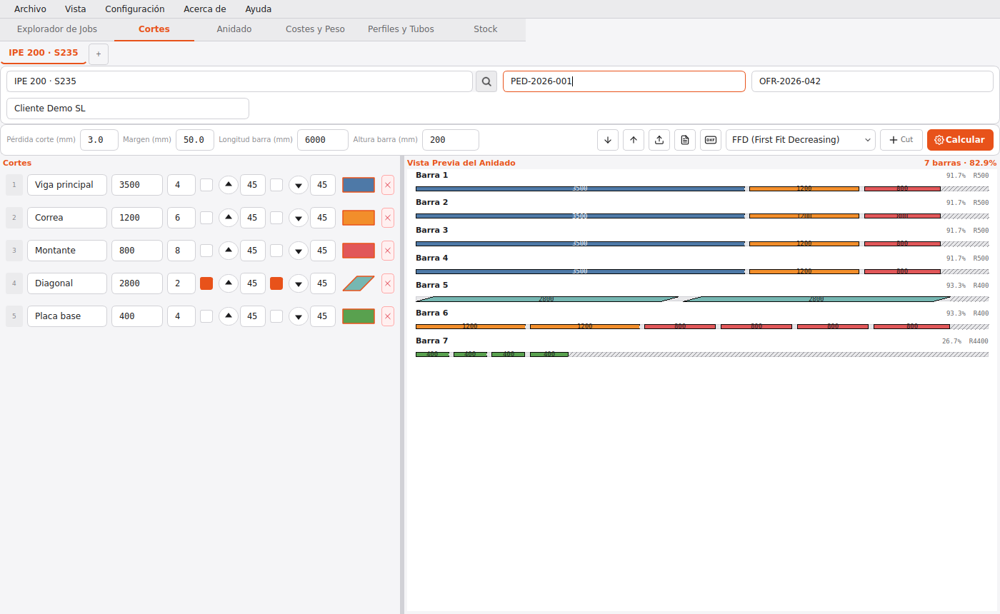 |  |
| **Costes y Peso** | **Perfiles y Tubos** |
|  | 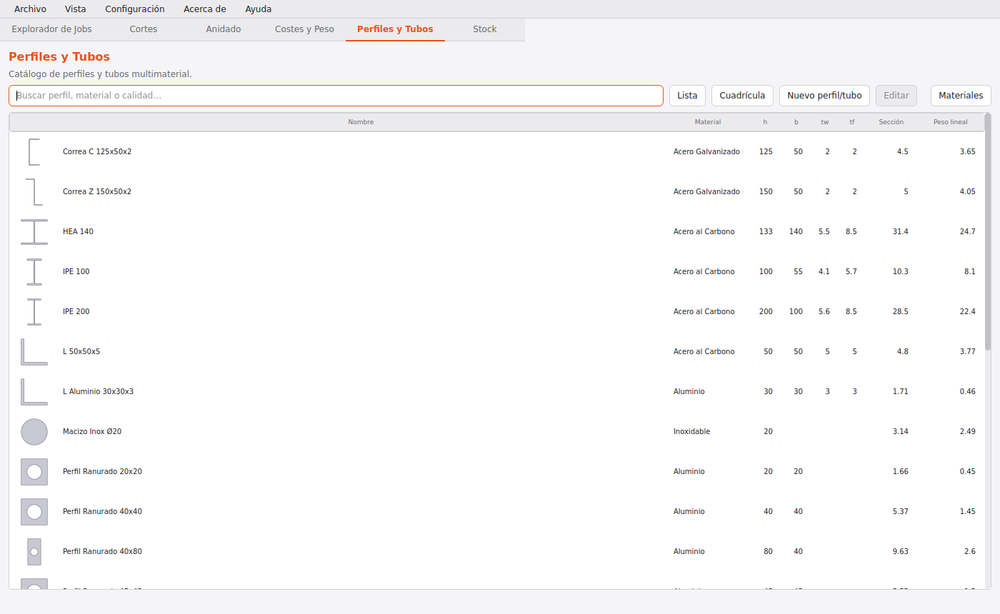 |
| **Stock** | **Explorador de trabajos** |
| 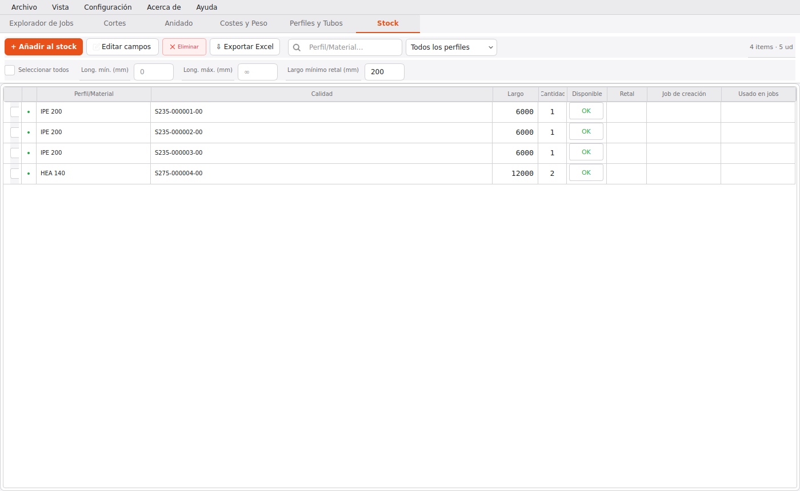 | 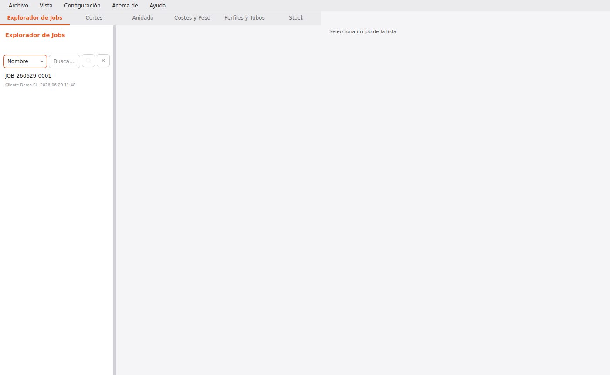 |

Hay tema claro y oscuro — cámbialo desde **Vista → Tema**. Las capturas usan el
tema claro.

<details>
<summary>Tema oscuro</summary>

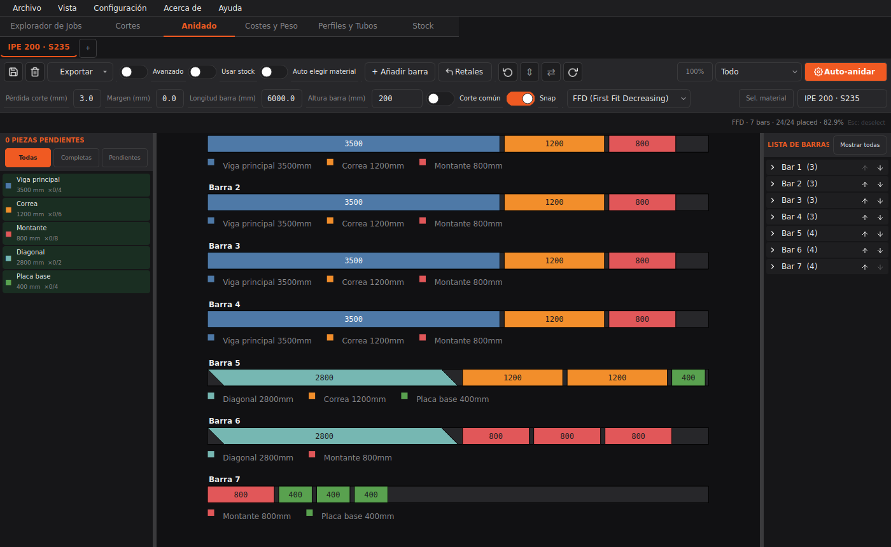

</details>

### Instalación

**Windows (instalador)** — descarga `Nestify-*-setup.exe` desde
[Releases](https://github.com/Grohle/nestify/releases) y ejecútalo. No requiere
Python. SmartScreen puede avisar de que el binario no está firmado: elige **Más
información → Ejecutar de todas formas**.

**Windows (portable)** — descarga `Nestify-*-windows.zip`, descomprime y ejecuta
`Nestify.exe`.

**Desde el código fuente** (Windows, macOS, Linux):

```bash
git clone https://github.com/Grohle/nestify.git
cd nestify
python3 -m venv venv && source venv/bin/activate   # Windows: venv\Scripts\activate
pip install -r requirements.txt
python3 main.py
```

Requiere **Python 3.10+** y las dependencias de `requirements.txt`.

### Las seis pestañas

| Pestaña | Para qué sirve |
|---------|----------------|
| **Explorador de trabajos** | Buscar, abrir y crear trabajos guardados. |
| **Cortes** | Introducir parámetros de barra y lista de cortes; elegir algoritmo; calcular. |
| **Nesting** | Revisar y ajustar el despiece en el lienzo; auto-nesting; exportar PDF/DXF/PNG. |
| **Costes y Peso** | Definir geometría y precios; obtener peso y coste por pieza y por trabajo. |
| **Perfiles y Tubos** | Catálogo de secciones integradas y personalizadas. |
| **Stock** | Inventario local de barras; planificar contra stock real y reutilizar retales. |

Cortes, Nesting y Costes admiten varias **sub-pestañas de material**, de modo que
un mismo trabajo puede contener varios perfiles. Costes añade una sub-pestaña
**Total** que los suma todos.

### Características

- Tres algoritmos de empaquetado con soporte de kerf y margen
- Ingletes/biseles con geometría 2D real (modo de nesting avanzado)
- Corte común para compartir una pasada de sierra entre piezas contiguas
- Planificación contra inventario de stock y reutilización de retales
- Biblioteca de perfiles integrada más secciones personalizadas
- Bases de materiales y stock con densidad, precios, números de serie y trazabilidad
- Importar cortes desde Excel; exportar cortes, presupuestos e inventario a Excel
- Exportar PDF (lista de corte, diagrama, presupuesto) con fuentes Unicode
- Exportar presupuesto a DOCX y contornos DXF por pieza
- Todos los datos en una única base de datos SQLite local — relocalizable a una unidad compartida, con copias de seguridad automáticas en cada arranque
- Unidades métricas e imperiales; temas oscuro y claro
- Interfaz en español e inglés
- Totalmente sin conexión: sin telemetría ni cuentas

### Privacidad

Nestify no se conecta a internet durante el uso normal. Los enlaces de menú
(GitHub, comprobar actualizaciones) se abren en el navegador solo cuando los
pulsas. Todos los datos se quedan en tu equipo.

### Créditos

Desarrollado por **Alberto Miranda**. Problemas y contribuciones en
[github.com/Grohle/nestify/issues](https://github.com/Grohle/nestify/issues).

### Licencia

Nestify se distribuye bajo la **GNU General Public License v3.0** (GPL-3.0).
Eres libre de usar, estudiar, modificar y redistribuir el programa siempre que
los trabajos derivados se publiquen también bajo la GPL-3.0. El texto completo
está en [`LICENSE`](LICENSE).

> El copyright lo conserva el autor. Si en el futuro necesitas una **licencia
> comercial** (uso en un producto propietario, sin las obligaciones de copyleft
> de la GPL), ponte en contacto a través de los
> [issues del repositorio](https://github.com/Grohle/nestify/issues).

### Contribuir

Las contribuciones son bienvenidas. Antes de enviar un Pull Request lee
[`CONTRIBUTING.md`](CONTRIBUTING.md): al contribuir aceptas el acuerdo de
licencia de contribuyente (CLA) que mantiene posible el doble licenciamiento.
