<p align="center">
  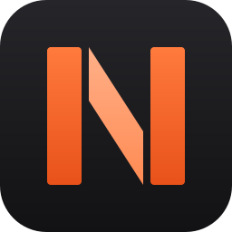
</p>

<h1 align="center">NesTube</h1>

<p align="center">
  <b>Bar, tube and profile cutting optimizer for metal fabrication shops.</b><br>
  Turn a cut list into a cutting plan: how many bars to buy, where every piece goes, and what the job weighs and costs.
</p>

<p align="center">
  <a href="https://github.com/Grohle/nestube/releases"></a>
  <a href="LICENSE"></a>
  
  
  
  <a href="https://github.com/Grohle/nestube/actions/workflows/tests.yml"></a>
</p>

<p align="center">
  <a href="https://buymeacoffee.com/grohle"></a>
</p>

<p align="center">
  <b><a href="#english">English</a></b> · <b><a href="#español">Español</a></b>
</p>

<p align="center">
  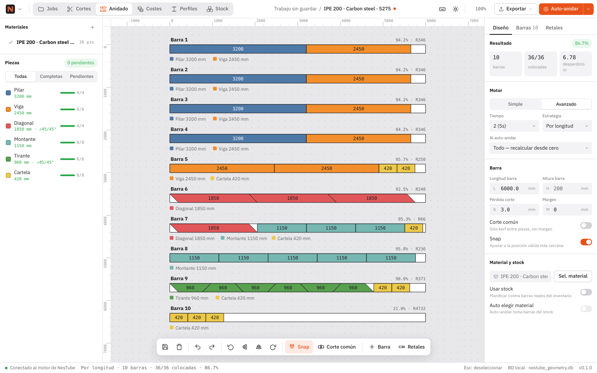
</p>

> **Status:** `0.1.0` — first release with the new interface. The core works and is tested,
> but interfaces and file formats may still change before `1.0`.

---

## English

NesTube helps you turn a list of required cuts into an efficient cutting plan.
You enter the stock bar length and the pieces you need (with quantities, miters
and kerf), and it works out how many bars to buy, how to lay the pieces out, and
what the job weighs and costs. Everything runs locally: no account, no cloud,
no network.

It's built for estimators, detailers and workshop staff who cut steel and
aluminium profiles and want to waste less material.

### What it does

- **Optimizes** the cut layout with three bin-packing strategies (FFD, BFD, NFD),
  accounting for blade kerf and end margin.
- **Visualizes** the result on an interactive nesting canvas, with miter/bevel
  geometry, manual adjustments and one-click auto-nest.
- **Estimates** weight, cost per piece, labour and total job cost from your
  profile geometry and price tables.
- **Exports** cutting lists, quotes and layouts to PDF, Excel, Word and DXF.

All your data (jobs, custom profiles, materials and stock) lives in a single
local SQLite database (`nestube_geometry.db`). You can point it at a shared or
network location from **File → Database management**, and it's snapshotted
automatically on launch. `.nestjob` files are an optional export format for
sharing a single job.

### What's new in 0.1

- **A new interface.** A modern, Figma-style window: tabs in the top bar, panels
  on both sides, a floating tool bar on the canvas, dark and light themes. It runs
  on the same engine as before, so collision checks, snap, auto-nest, costs,
  catalogue, stock and jobs behave exactly the same, with the same shortcuts.
- **Profile image viewer:** open any profile picture full size, with zoom.
- **AutoCAD-style drawing module** for custom profiles: ribbon, command line,
  typed lengths, `@dx,dy` and `@length<angle` input, object snaps, ORTHO and GRID.
- **Fixes:** a moved piece now drops back into its own slot (it used to jump to
  another one), the Nesting tab uses the cutting height it shows, and Ctrl+click
  multi-selects again.

The previous Qt window is still there: start NesTube with `--classic`
(or set `NESTUBE_CLASSIC=1`).

### Screenshots

| Nesting | Cuts |
|---|---|
|  | 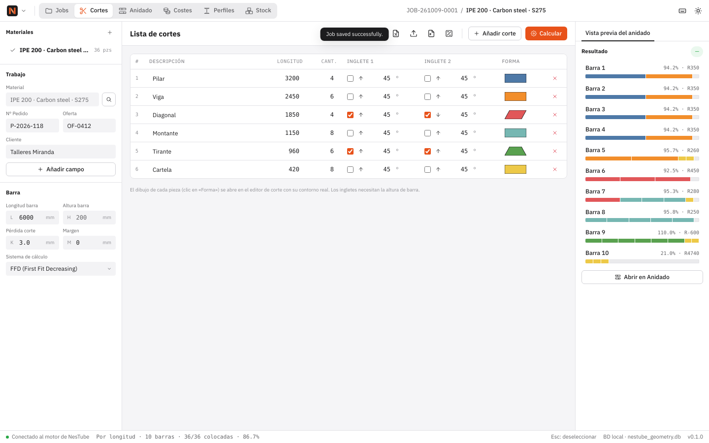 |
| **Costs & Weight** | **Profiles & Tubes** |
| 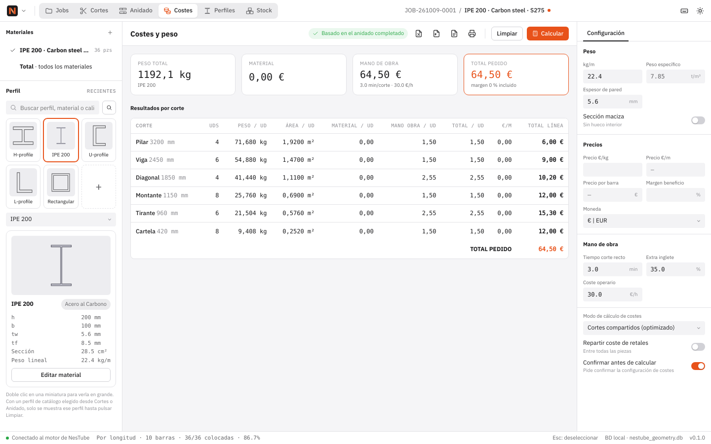 | 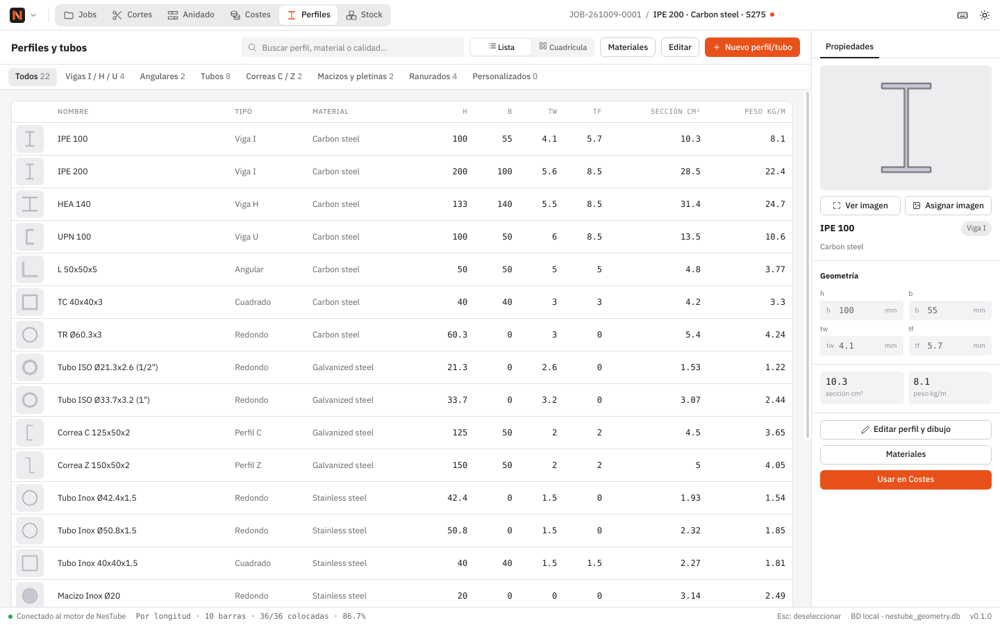 |
| **Stock** | **Jobs** |
| 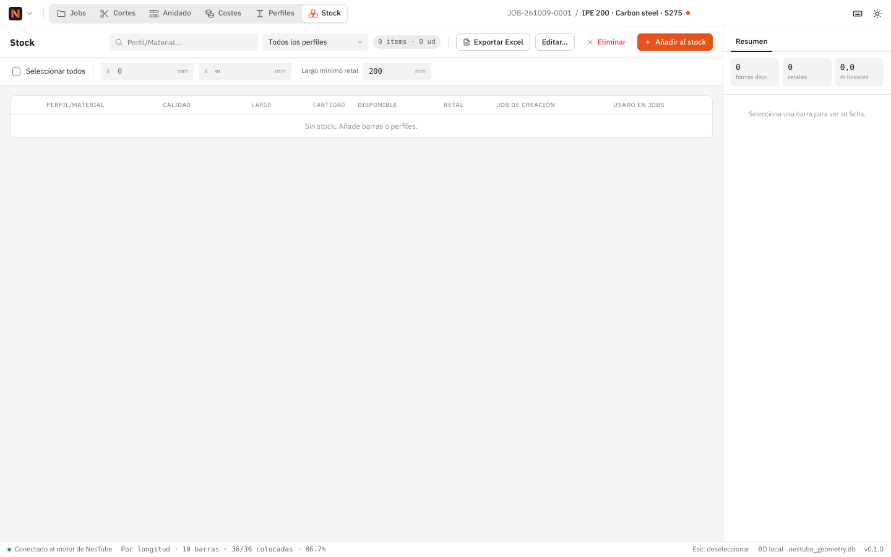 | 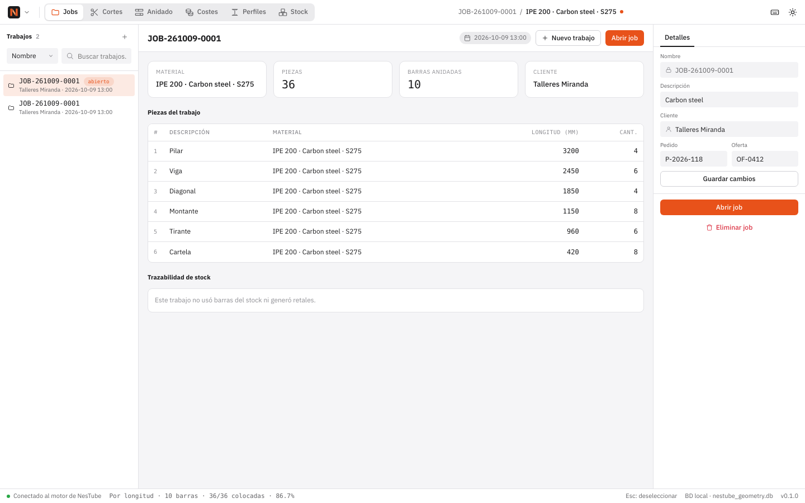 |
| **Drawing module** | **Dark theme** |
| 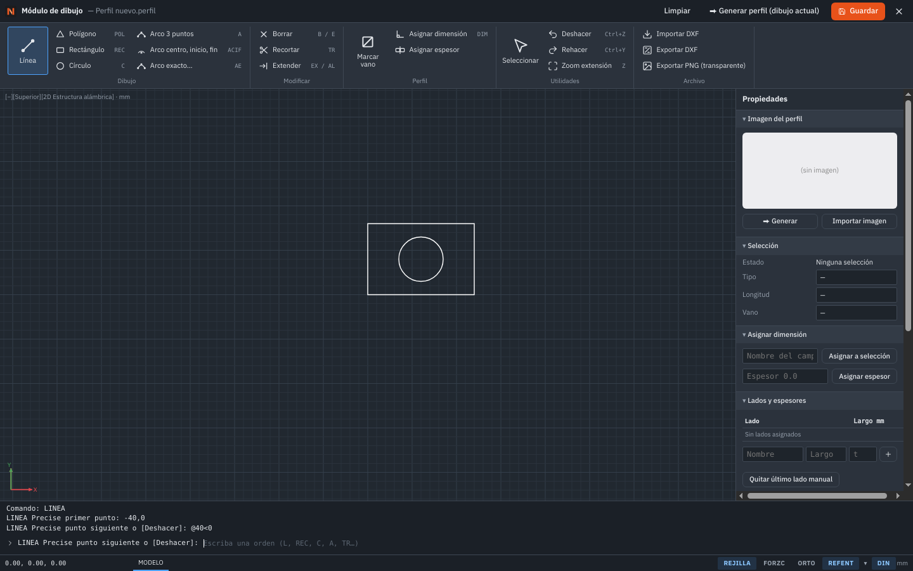 | 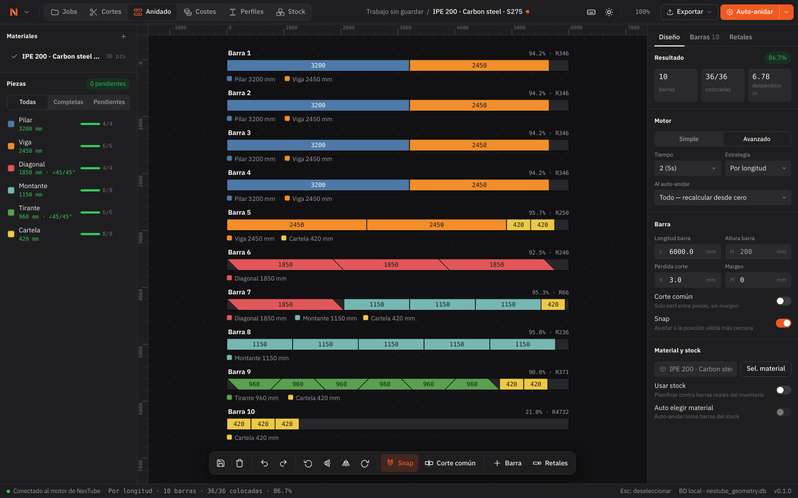 |

Switch between light and dark with the sun/moon button in the top bar.

<details>
<summary>Walkthrough of the classic interface (video)</summary>

<p align="center">
  <a href="docs/media/nestube_demo_en.mp4">
    
  </a>
</p>

<p align="center"><sub>▶ Click for full-quality video. Classic-interface screenshots are in <code>docs/img/en</code>.</sub></p>

</details>

### Requirements

- **Windows 10/11, Linux or macOS** (64-bit).
- The release bundles include everything they need (Python, Qt, the web engine,
  fonts and icons). No Python install is required.
- Linux bundles need these system libraries:
  `libxkbcommon-x11-0 libxcb-xkb1 libxcb-cursor0 libegl1 libnss3 libxcomposite1 libxdamage1 libxrandr2 libxtst6 libasound2`
- From source: **Python 3.10+** and the packages in `requirements.txt` (PySide6
  with Qt WebEngine, fpdf2, openpyxl, pandas, python-docx, ezdxf, shapely, numpy,
  pyclipper, Pillow).

### Installing

**Windows (installer):** download the latest `NesTube-*-setup.exe` from
[Releases](https://github.com/Grohle/nestube/releases) and run it.
SmartScreen may warn that the program is unsigned. Choose
**More info → Run anyway**.

**Windows (portable):** download `NesTube-*-windows.zip`, extract it and run
`NesTube.exe`.

**Linux / macOS (portable):** download the `linux` or `macos` zip, extract it and
run `./NesTube/NesTube`. On macOS, clear the quarantine flag first:
`xattr -dr com.apple.quarantine NesTube`.

**From source** (Windows, macOS, Linux):

```bash
git clone https://github.com/Grohle/nestube.git
cd nestube
python3 -m venv venv && source venv/bin/activate   # Windows: venv\Scripts\activate
pip install -r requirements.txt
python3 main.py              # new interface
python3 main.py --classic    # classic Qt interface
```

On a headless Linux box, run under a virtual display:

```bash
Xvfb :99 -screen 0 1280x1024x24 &
DISPLAY=:99 python3 main.py
```

### The six tabs

| Tab | What you do there |
|-----|-------------------|
| **Jobs** | Browse, search, open and create saved jobs. |
| **Cuts** | Enter bar parameters and the cut list; pick the packing algorithm; calculate. |
| **Nesting** | Review and tweak the layout on an interactive canvas; auto-nest; export PDF/DXF/PNG. |
| **Costs & Weight** | Set profile geometry and pricing; get weight and cost per piece and per job. |
| **Profiles & Tubes** | Catalogue of built-in and custom sections (IPE, HEA, UPN, angles, tubes…). |
| **Stock** | Local bar inventory; plan against real stock and reuse offcuts. |

Cuts, Nesting and Costs each support multiple **material sub-tabs**, so one job
file can hold several profiles or materials. The Costs tab adds a **Total**
sub-tab that sums them all.

The three packing algorithms:

| Code | Algorithm | Behaviour |
|------|-----------|-----------|
| **FFD** | First-Fit Decreasing | Sort pieces largest-first; place each in the first bar that fits. |
| **BFD** | Best-Fit Decreasing | Place each piece in the bar that leaves the least leftover. |
| **NFD** | Next-Fit Decreasing | Fill the current bar; open a new one when a piece doesn't fit. |

### Nesting shortcuts

| Keys | Action |
|------|--------|
| Click a piece, click it again | Select it, then pick it up to move it |
| Drag a piece | Move it (it snaps to the nearest valid slot) |
| `Ctrl` + click | Add to / remove from the selection |
| `Ctrl+Q` / `Ctrl+E` | Rotate left / right (also while carrying a piece) |
| `Ctrl+H` / `Ctrl+A` | Flip horizontally / vertically |
| `Delete` | Take the selected pieces off the bar |
| `Esc` | Stop auto-nest, drop the carried piece, clear the selection |
| `Ctrl+Z` / `Ctrl+Y` | Undo / redo |
| `Ctrl+S` | Save |
| Wheel · middle drag · drag on empty canvas | Zoom · pan · pan |
| `?` | Show every shortcut |

### Features

- Three packing algorithms with kerf and margin support
- Miter/bevel cuts with real 2D contour geometry (advanced nesting mode)
- Common-cut option to share a single blade pass between adjacent pieces
- Plan against real stock inventory and promote offcuts back to reusable stock
- Built-in profile library plus user-defined custom sections
- Materials and stock databases with density, pricing, serials and job traceability
- Import cut lists from Excel; export cut lists, quotes and inventory to Excel
- PDF export (cutting list, nesting diagram, quote) with bundled Unicode fonts
- DOCX quote export and per-piece DXF contour export
- All data in one local SQLite database, relocatable to a shared drive, with rolling automatic backups on every launch
- Metric and imperial units; dark and light themes
- English and Spanish interface
- Fully offline: no telemetry, no accounts

### Menus

The **N** button at the top left opens the main menu.

| Menu | Contents |
|------|----------|
| **File** | Open, Save (`Ctrl+S`), Save As, save/load app config, Backups, Database management, Exit |
| **View** | Theme (dark/light), Language (English/Spanish), units (metric/imperial), per-cut colours |
| **Settings** | Materials, profile types, PDF config, cost defaults, optimisation time, nesting layout, name assignment |
| **About / Help** | Version and update check; tutorial; link to report an issue |

### Data files

Everything stays on your machine, next to `NesTube.exe` (or in the project root
when running from source). The database can be moved to a shared drive from
**File → Database management**.

| Path | Purpose |
|------|---------|
| `nestube_geometry.db` | The database: jobs, custom profiles, materials, stock inventory and preferences |
| `nestube_db_location.json` | Bootstrap pointer to the database location and backup policy |
| `backups/` | Rolling automatic database snapshots |
| `*.nestjob` | Optional export of a single job (cuts, profile, nesting state, costs) |
| `Profiles/` | Thumbnail cache for profile illustrations (rebuilt from the database) |
| `dxf/` | Auto-generated DXF contour files per piece |

Earlier versions kept preferences, materials, stock and profiles in separate
JSON files; those are imported into the database automatically on first launch
and retired to `*.migrated`. Packing results are recomputed at runtime, so
reopen a job and press **Calculate** to refresh them.

### Building it yourself

On Windows (PowerShell, from the repo root):

```powershell
.\packaging\build_installer.ps1     # PyInstaller + Inno Setup → NesTube-<version>-setup.exe
```

Or build the bundle manually (any platform):

```bash
pip install -r requirements.txt -r requirements-build.txt
pyinstaller --noconfirm packaging/nestube.spec
```

Pushing a `v*` tag (or a `release/**` branch) runs `.github/workflows/release.yml`,
which builds the Windows, Linux and macOS bundles and publishes a pre-release.

### How it's built

The window is a Qt WebEngine view showing the HTML interface in `nestube/web`.
A QWebChannel bridge (`nestube/ui_web`) connects it to the engine: a hidden
instance of the Qt application whose tabs hold all the logic. The page sends
clicks and drags in millimetres, the engine decides (collision, snap,
auto-nest) and sends back the new state. Nothing is calculated twice.

```
nestube/
├── main.py                  # Entry point (--classic for the Qt widgets UI)
├── requirements.txt
├── packaging/               # PyInstaller spec, Inno Setup script, build scripts
├── docs/                    # Screenshots, logo, UI inventory
├── tests/                   # Test suite (pytest)
├── .devcontainer/           # Dev tooling and guides (not shipped)
└── nestube/
    ├── logic.py             # Bin packing, area, weight, cost
    ├── nesting_engine.py    # 2D contour nesting
    ├── bevel_geom.py        # Miter/bevel geometry and DXF collision
    ├── models.py            # Core data classes
    ├── i18n.py              # Translatable strings
    ├── stock_db.py          # Stock persistence
    ├── ui_qt/               # PySide6 engine and classic UI (one module per tab, dialogs, theme)
    ├── ui_web/              # Web window and the JS ↔ Python bridge
    └── web/                 # HTML interface (index.html, css/, js/)
```

`logic.py`, `nesting_engine.py` and `bevel_geom.py` are the calculation core;
`tests/test_web_bridge.py` drives the interface through the bridge (auto-nest,
then random picks, rotations and drops, checking for overlaps and lost pieces).
Run the suite before sending a change:

```bash
QT_QPA_PLATFORM=offscreen python3 -m pytest tests/ -q
flake8 --max-line-length=120 nestube/ main.py
```

Every button, menu and alert of the new interface is listed in
**[docs/ui-inventario.md](docs/ui-inventario.md)**.

### Optional FastReport integration

NesTube has a built-in WYSIWYG editor for PDF layouts (**Settings → PDF Config →
Edit layout**). For advanced templates you can also open a `.frx` file in
[FastReport Community Edition](https://github.com/FastReports/FastReport), the
free, open-source report designer, via **Settings → PDF Config → Base PDF
template**. It's a separate tool and isn't required to use NesTube.

### Privacy

NesTube makes no network connections during normal use. Menu links (GitHub,
update check) open in your browser only when you click them. All project data
stays local.

### Acknowledgments

- [Qt for Python (PySide6)](https://doc.qt.io/qtforpython/) for the window, the web engine and the bridge.
- [Shapely](https://shapely.readthedocs.io/) and [pyclipper](https://github.com/fonttools/pyclipper) for the contour geometry behind collisions and nesting.
- [ezdxf](https://ezdxf.mozman.at/), [fpdf2](https://py-pdf.github.io/fpdf2/), [openpyxl](https://openpyxl.readthedocs.io/), [python-docx](https://python-docx.readthedocs.io/), [pandas](https://pandas.pydata.org/), [NumPy](https://numpy.org/) and [Pillow](https://python-pillow.org/) for import and export.
- [FastReport Community Edition](https://github.com/FastReports/FastReport) for the optional report designer.

### Credits

Developed by **Alberto Miranda**. Bug reports and contributions are welcome at
[github.com/Grohle/nestube/issues](https://github.com/Grohle/nestube/issues).
If NesTube saves you material, you can
[buy me a coffee](https://buymeacoffee.com/grohle) ☕.

### License

NesTube is released under the **GNU General Public License v3.0** (GPL-3.0).
You're free to use, study, modify and redistribute it, as long as derived
works are also published under the GPL-3.0. The full text is in
[`LICENSE`](LICENSE).

> The author keeps the copyright. If you need a **commercial license** (use in a
> proprietary product, without the GPL's copyleft obligations), get in touch
> through the [repository issues](https://github.com/Grohle/nestube/issues).

### Contributing

Contributions are welcome. Before opening a Pull Request, read
[`CONTRIBUTING.md`](CONTRIBUTING.md): by contributing you accept the
contributor license agreement (CLA) that keeps dual licensing possible.

---

## Español

NesTube convierte una lista de cortes en un plan de corte eficiente. Introduces
la longitud de la barra y las piezas que necesitas (cantidades, ingletes, kerf)
y calcula cuántas barras comprar, cómo distribuir las piezas y cuánto pesa y
cuesta el trabajo. Todo funciona en local: sin cuentas, sin nube, sin red.

Está pensado para presupuestadores, delineantes y personal de taller que cortan
perfiles de acero y aluminio y quieren reducir el desperdicio.

### Qué hace

- **Optimiza** el despiece con tres algoritmos (FFD, BFD, NFD), teniendo en
  cuenta el espesor de corte (kerf) y el margen.
- **Visualiza** el resultado en un lienzo de anidado interactivo, con geometría
  de inglete, ajustes manuales y auto-anidado con un clic.
- **Estima** peso, coste por pieza, mano de obra y coste total a partir de la
  geometría del perfil y tus tarifas.
- **Exporta** listas de corte, presupuestos y layouts a PDF, Excel, Word y DXF.

Todos tus datos (trabajos, perfiles personalizados, materiales y stock) viven
en una única base de datos SQLite local (`nestube_geometry.db`). Puedes moverla a
una ubicación compartida o de red desde **Archivo → Gestión de base de datos**, y
se respalda automáticamente en cada arranque. Los archivos `.nestjob` son un
formato de exportación opcional para compartir un trabajo concreto.

### Novedades de la 0.1

- **Interfaz nueva.** Una ventana moderna, al estilo de Figma: pestañas en la
  barra superior, paneles a ambos lados, barra de herramientas flotante sobre el
  lienzo y temas oscuro y claro. Funciona sobre el mismo motor de siempre, así
  que colisiones, imán, auto-anidado, costes, catálogo, stock y jobs se comportan
  igual, con los mismos atajos.
- **Visor de imágenes de perfiles:** abre cualquier foto de perfil a tamaño
  completo, con zoom.
- **Módulo de dibujo al estilo AutoCAD** para perfiles a medida: cinta, línea de
  comandos, longitudes tecleadas, entrada `@dx,dy` y `@longitud<ángulo`,
  referencias a objetos, ORTO y REJILLA.
- **Correcciones:** una pieza movida vuelve a su propio hueco (antes saltaba a
  otro), la pestaña Anidado usa la altura de corte que muestra y Ctrl+clic vuelve
  a hacer selección múltiple.

La ventana Qt anterior sigue disponible: arranca NesTube con `--classic`
(o define `NESTUBE_CLASSIC=1`).

### Capturas

| Anidado | Cortes |
|---|---|
|  |  |
| **Costes y Peso** | **Perfiles y Tubos** |
|  |  |
| **Stock** | **Jobs** |
|  |  |
| **Módulo de dibujo** | **Tema oscuro** |
| 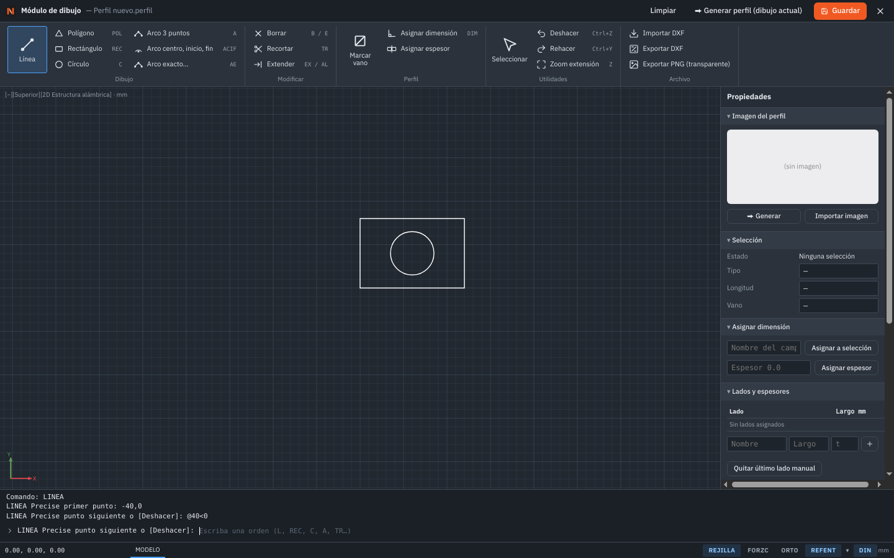 |  |

Cambia entre tema claro y oscuro con el botón del sol/luna de la barra superior.

<details>
<summary>Recorrido por la interfaz clásica (vídeo)</summary>

<p align="center">
  <a href="docs/media/nestube_demo.mp4">
    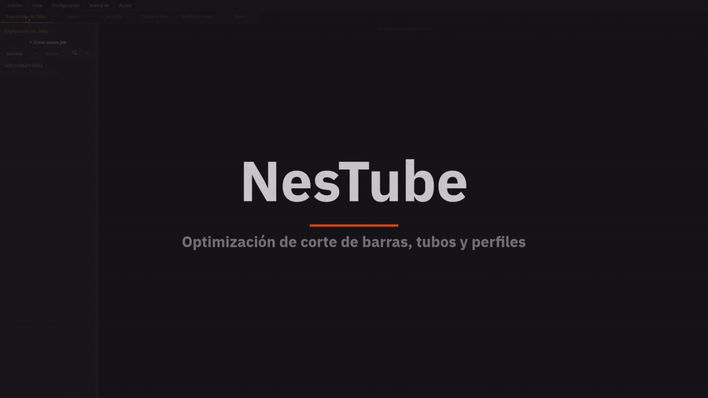
  </a>
</p>

<p align="center"><sub>▶ Haz clic para ver el vídeo en calidad completa. Las capturas de la interfaz clásica están en <code>docs/img/es</code>.</sub></p>

</details>

### Requisitos

- **Windows 10/11, Linux o macOS** (64 bits).
- Los paquetes de cada versión incluyen todo lo necesario (Python, Qt, el motor
  web, fuentes e iconos). No hace falta instalar Python.
- En Linux hacen falta estas librerías del sistema:
  `libxkbcommon-x11-0 libxcb-xkb1 libxcb-cursor0 libegl1 libnss3 libxcomposite1 libxdamage1 libxrandr2 libxtst6 libasound2`
- Desde el código fuente: **Python 3.10+** y las dependencias de
  `requirements.txt` (PySide6 con Qt WebEngine, fpdf2, openpyxl, pandas,
  python-docx, ezdxf, shapely, numpy, pyclipper, Pillow).

### Instalación

**Windows (instalador):** descarga `NesTube-*-setup.exe` desde
[Releases](https://github.com/Grohle/nestube/releases) y ejecútalo.
SmartScreen puede avisar de que el programa no está firmado. Elige **Más
información → Ejecutar de todas formas**.

**Windows (portable):** descarga `NesTube-*-windows.zip`, descomprime y ejecuta
`NesTube.exe`.

**Linux / macOS (portable):** descarga el zip `linux` o `macos`, descomprímelo y
ejecuta `./NesTube/NesTube`. En macOS, quita antes la cuarentena:
`xattr -dr com.apple.quarantine NesTube`.

**Desde el código fuente** (Windows, macOS, Linux):

```bash
git clone https://github.com/Grohle/nestube.git
cd nestube
python3 -m venv venv && source venv/bin/activate   # Windows: venv\Scripts\activate
pip install -r requirements.txt
python3 main.py              # interfaz nueva
python3 main.py --classic    # interfaz Qt clásica
```

En un Linux sin pantalla, usa una pantalla virtual:

```bash
Xvfb :99 -screen 0 1280x1024x24 &
DISPLAY=:99 python3 main.py
```

### Las seis pestañas

| Pestaña | Para qué sirve |
|---------|----------------|
| **Jobs** | Buscar, abrir y crear trabajos guardados. |
| **Cortes** | Introducir parámetros de barra y lista de cortes; elegir algoritmo; calcular. |
| **Anidado** | Revisar y ajustar el despiece en el lienzo; auto-anidado; exportar PDF/DXF/PNG. |
| **Costes y Peso** | Definir geometría y precios; obtener peso y coste por pieza y por trabajo. |
| **Perfiles y Tubos** | Catálogo de secciones integradas y personalizadas (IPE, HEA, UPN, angulares, tubos…). |
| **Stock** | Inventario local de barras; planificar contra stock real y reutilizar retales. |

Cortes, Anidado y Costes admiten varias **sub-pestañas de material**, de modo que
un mismo trabajo puede contener varios perfiles. Costes añade una sub-pestaña
**Total** que los suma todos.

Los tres algoritmos de empaquetado:

| Código | Algoritmo | Comportamiento |
|--------|-----------|----------------|
| **FFD** | First-Fit Decreasing | Ordena las piezas de mayor a menor; coloca cada una en la primera barra donde cabe. |
| **BFD** | Best-Fit Decreasing | Coloca cada pieza en la barra que deja menos sobrante. |
| **NFD** | Next-Fit Decreasing | Llena la barra actual; abre otra cuando una pieza no cabe. |

### Atajos del anidado

| Teclas | Acción |
|--------|--------|
| Clic en una pieza y otro clic | Seleccionarla y después cogerla para moverla |
| Arrastrar una pieza | Moverla (se imanta al hueco válido más cercano) |
| `Ctrl` + clic | Añadir o quitar de la selección |
| `Ctrl+Q` / `Ctrl+E` | Rotar a la izquierda / derecha (también con la pieza en el aire) |
| `Ctrl+H` / `Ctrl+A` | Voltear en horizontal / vertical |
| `Supr` | Quitar de la barra las piezas seleccionadas |
| `Esc` | Detener el auto-anidado, soltar la pieza en el aire, deseleccionar |
| `Ctrl+Z` / `Ctrl+Y` | Deshacer / rehacer |
| `Ctrl+S` | Guardar |
| Rueda · arrastre con botón central · arrastre en vacío | Zoom · desplazar · desplazar |
| `?` | Ver todos los atajos |

### Características

- Tres algoritmos de empaquetado con soporte de kerf y margen
- Ingletes/biseles con geometría 2D real (modo de anidado avanzado)
- Corte común para compartir una pasada de sierra entre piezas contiguas
- Planificación contra inventario de stock y reutilización de retales
- Biblioteca de perfiles integrada más secciones personalizadas
- Bases de materiales y stock con densidad, precios, números de serie y trazabilidad
- Importar cortes desde Excel; exportar cortes, presupuestos e inventario a Excel
- Exportar PDF (lista de corte, diagrama, presupuesto) con fuentes Unicode
- Exportar presupuesto a DOCX y contornos DXF por pieza
- Todos los datos en una única base de datos SQLite local, relocalizable a una unidad compartida, con copias de seguridad automáticas en cada arranque
- Unidades métricas e imperiales; temas oscuro y claro
- Interfaz en español e inglés
- Totalmente sin conexión: sin telemetría ni cuentas

### Menús

El botón **N** de arriba a la izquierda abre el menú principal.

| Menú | Contenido |
|------|-----------|
| **Archivo** | Abrir, Guardar (`Ctrl+S`), Guardar como, guardar/cargar configuración, Copias de seguridad, Gestión de base de datos, Salir |
| **Vista** | Tema (oscuro/claro), idioma (español/inglés), unidades (métricas/imperiales), colores por corte |
| **Ajustes** | Materiales, tipos de perfil, configuración de PDF, costes por defecto, tiempo de optimización, disposición del anidado, asignación de nombres |
| **Acerca de / Ayuda** | Versión y comprobación de actualizaciones; tutorial; enlace para reportar un problema |

### Archivos de datos

Todo se queda en tu equipo, junto a `NesTube.exe` (o en la raíz del proyecto si
lo ejecutas desde el código fuente). La base de datos se puede mover a una
unidad compartida desde **Archivo → Gestión de base de datos**.

| Ruta | Para qué sirve |
|------|----------------|
| `nestube_geometry.db` | La base de datos: trabajos, perfiles personalizados, materiales, stock y preferencias |
| `nestube_db_location.json` | Puntero de arranque a la ubicación de la base de datos y la política de copias |
| `backups/` | Copias automáticas de la base de datos |
| `*.nestjob` | Exportación opcional de un trabajo (cortes, perfil, anidado, costes) |
| `Profiles/` | Caché de miniaturas de los perfiles (se regenera desde la base de datos) |
| `dxf/` | Contornos DXF generados automáticamente para cada pieza |

Las versiones anteriores guardaban preferencias, materiales, stock y perfiles en
archivos JSON separados; se importan a la base de datos automáticamente en el
primer arranque y se renombran a `*.migrated`. Los resultados de empaquetado se
recalculan al usar la aplicación, así que abre un trabajo y pulsa **Calcular**
para actualizarlos.

### Compilarlo tú mismo

En Windows (PowerShell, desde la raíz del repositorio):

```powershell
.\packaging\build_installer.ps1     # PyInstaller + Inno Setup → NesTube-<versión>-setup.exe
```

O compila el paquete a mano (cualquier sistema):

```bash
pip install -r requirements.txt -r requirements-build.txt
pyinstaller --noconfirm packaging/nestube.spec
```

Subir una etiqueta `v*` (o una rama `release/**`) lanza
`.github/workflows/release.yml`, que compila los paquetes de Windows, Linux y
macOS y publica una pre-versión.

### Cómo está hecho

La ventana es una vista Qt WebEngine que muestra la interfaz HTML de
`nestube/web`. Un puente QWebChannel (`nestube/ui_web`) la conecta con el motor:
una instancia oculta de la aplicación Qt cuyas pestañas contienen toda la
lógica. La página envía clics y arrastres en milímetros, el motor decide
(colisiones, imán, auto-anidado) y devuelve el estado nuevo. Nada se calcula dos
veces.

La estructura del proyecto está en la sección en inglés. Ejecuta los tests antes
de enviar un cambio:

```bash
QT_QPA_PLATFORM=offscreen python3 -m pytest tests/ -q
flake8 --max-line-length=120 nestube/ main.py
```

Cada botón, menú y aviso de la interfaz nueva está listado en
**[docs/ui-inventario.md](docs/ui-inventario.md)**.

### Integración opcional con FastReport

NesTube trae un editor visual de plantillas PDF (**Ajustes → Configuración de
PDF → Editar diseño**). Para plantillas avanzadas también puedes abrir un archivo
`.frx` en [FastReport Community Edition](https://github.com/FastReports/FastReport),
el diseñador de informes libre y gratuito, desde **Ajustes → Configuración de PDF
→ Plantilla PDF base**. Es una herramienta aparte y no hace falta para usar
NesTube.

### Privacidad

NesTube no se conecta a internet durante el uso normal. Los enlaces de menú
(GitHub, comprobar actualizaciones) se abren en el navegador solo cuando los
pulsas. Todos los datos se quedan en tu equipo.

### Agradecimientos

- [Qt for Python (PySide6)](https://doc.qt.io/qtforpython/) por la ventana, el motor web y el puente.
- [Shapely](https://shapely.readthedocs.io/) y [pyclipper](https://github.com/fonttools/pyclipper) por la geometría de contornos detrás de las colisiones y el anidado.
- [ezdxf](https://ezdxf.mozman.at/), [fpdf2](https://py-pdf.github.io/fpdf2/), [openpyxl](https://openpyxl.readthedocs.io/), [python-docx](https://python-docx.readthedocs.io/), [pandas](https://pandas.pydata.org/), [NumPy](https://numpy.org/) y [Pillow](https://python-pillow.org/) por la importación y exportación.
- [FastReport Community Edition](https://github.com/FastReports/FastReport) por el diseñador de informes opcional.

### Créditos

Desarrollado por **Alberto Miranda**. Problemas y contribuciones en
[github.com/Grohle/nestube/issues](https://github.com/Grohle/nestube/issues).
Si NesTube te ahorra material, puedes
[invitarme a un café](https://buymeacoffee.com/grohle) ☕.

### Licencia

NesTube se distribuye bajo la **GNU General Public License v3.0** (GPL-3.0).
Eres libre de usar, estudiar, modificar y redistribuir el programa siempre que
los trabajos derivados se publiquen también bajo la GPL-3.0. El texto completo
está en [`LICENSE`](LICENSE).

> El copyright lo conserva el autor. Si en el futuro necesitas una **licencia
> comercial** (uso en un producto propietario, sin las obligaciones de copyleft
> de la GPL), ponte en contacto a través de los
> [issues del repositorio](https://github.com/Grohle/nestube/issues).

### Contribuir

Las contribuciones son bienvenidas. Antes de enviar un Pull Request lee
[`CONTRIBUTING.md`](CONTRIBUTING.md): al contribuir aceptas el acuerdo de
licencia de contribuyente (CLA) que mantiene posible el doble licenciamiento.
